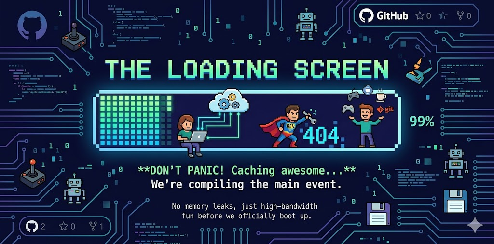

# The Loading Screen



**The Loading Screen** is an interactive, real-time web application designed for pre-event entertainment. It provides a massive "Stage View" (typically displayed on a projector or large screen) and a lightweight "Mobile Interface" allowing the audience to interact with the screen in real-time.

Don't panic! Your reality isn't lagging, we're just caching the awesome. While we compile the main event, enjoy some "analog" networking and tech-trivia. No 404s, no memory leaks—just high-bandwidth fun before we officially boot up.

## 🏗 Architecture Overview

The system is designed to be **100% stateless**, lightweight, and optimized for rapid scaling on Google Cloud Run.

* **Backend Environment:** Node.js 20+
* **Real-Time Communication:** Express + WebSockets (Socket.io)
* **Deployment:** Dockerized and bound to the `$PORT` environment variable for Google Cloud Run.
* **Storage/Database:** None. The application operates entirely in memory to minimize latency and simplify horizontal scaling.

## 🎮 Core Components

### 1. Stage View (Main Screen)
The visual centerpiece of the experience, featuring:
* **The I/O Event Portal:** A moving digital gateway acting as the vanishing point.
* **Circuit Board Aesthetics:** Procedurally generated neon traces and geometric grids inspired by retro 8-bit hacker culture.
* **The Muggle March:** When attendees launch a "Muggle" from their phones, a pixel-art character (e.g., a developer superman, a coder with a laptop, or a juggler) appears on the canvas. These characters march towards the portal, dynamically shrinking to create a 3D perspective effect.
* **Dynamic QR Code:** Automatically generates a QR code pointing to the mobile interface URL.

### 2. Mobile Interface (Launch Control)
A zero-install web app for attendees:
* **Message Input:** Users can input a message (max 25 characters) that will float above their Muggle like a chat bubble.
* **Motion Sensors API:** Utilizes the HTML5 `DeviceMotion` API. Users must click "Ready to Launch" to explicitly grant accelerometer permissions (a strict requirement for iOS 13+).
* **Shake to Launch:** Once armed, shaking the physical phone emits a WebSocket event that instantly spawns their customized Muggle on the Stage View. (A manual "Tap to Launch" fallback is provided).

## 🚀 How to Run Locally

### Using Docker
```bash
# Build the lightweight Alpine image
docker build -t loading-screen .

# Run the container
docker run -d -p 8080:8080 -e PORT=8080 --name loading-screen-app loading-screen
```

### Using Node.js directly (For Development)
```bash
# Install dependencies
npm install

# Start the server
npm start
```

### Testing the Experience
1. Open a browser on your machine and navigate to **[http://localhost:8080](http://localhost:8080)** to see the Stage View.
2. For testing the mobile interaction on your actual phone, ensure you access the Stage View using your local network IP (e.g., `http://192.168.1.X:8080`). This ensures the generated QR code directs your phone to the correct local address instead of `localhost`.
3. Alternatively, click the "Tap to Launch" button provided in the mobile view fallback.

## 🤝 Contributing
Please ensure all code, commits, and comments remain in English to maintain a universal standard across the codebase.
